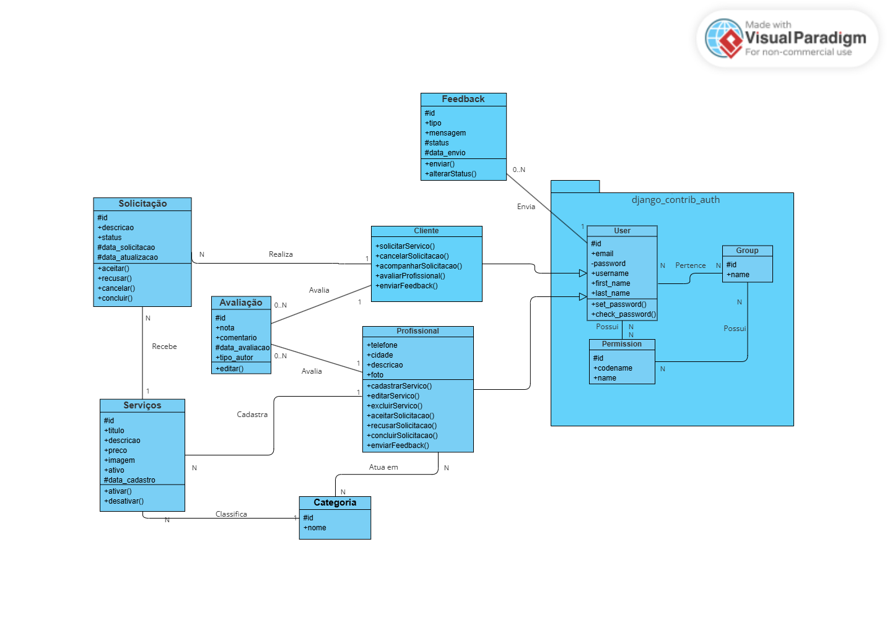

# Plataforma Digital para Divulgação de Serviços Prestados por Profissionais Autônomos

Plataforma web desenvolvida em Python e Django para facilitar a conexão entre profissionais autônomos e clientes, permitindo a divulgação, busca, solicitação e avaliação de serviços.

O projeto está sendo desenvolvido como atividade acadêmica da disciplina de Programação de Sistemas Web (PSW).

## Sumário

- [Sobre o projeto](#sobre-o-projeto)
- [Tecnologias utilizadas](#tecnologias-utilizadas)
- [Estrutura do projeto](#estrutura-do-projeto)
- [Pré-requisitos](#pré-requisitos)
- [Como executar no Windows](#como-executar-no-windows)
- [Como executar no Linux](#como-executar-no-linux)
- [Variáveis de ambiente](#variáveis-de-ambiente)
- [Banco de dados](#banco-de-dados)
- [Painel administrativo](#painel-administrativo)
- [Comandos úteis](#comandos-úteis)
- [Boas práticas](#boas-práticas)
- [Status do projeto](#status-do-projeto)

## Sobre o projeto

A **Plataforma Digital para Divulgação de Serviços Prestados por Profissionais Autônomos** tem como objetivo facilitar a conexão entre profissionais e clientes.

A plataforma permitirá que visitantes consultem profissionais e serviços disponíveis, enquanto usuários cadastrados poderão utilizar funcionalidades que exigem identificação.

Entre as principais funcionalidades previstas estão:

- Cadastro e autenticação de clientes e profissionais.
- Gerenciamento do perfil dos profissionais.
- Cadastro e gerenciamento de serviços.
- Organização de profissionais e serviços por categorias.
- Busca de profissionais e serviços.
- Solicitação de serviços por clientes.
- Gerenciamento das solicitações pelos profissionais.
- Avaliações entre clientes e profissionais.
- Envio de feedbacks sobre a plataforma.
- Área de ajuda para clientes e profissionais.
- Administração da plataforma por meio do painel administrativo do Django.

## Tecnologias utilizadas

- Python
- Django
- SQLite
- HTML5
- CSS3
- JavaScript
- Bootstrap
- Git
- GitHub

## Estrutura do projeto

O projeto está organizado nos seguintes aplicativos Django:

- `usuarios`: funcionalidades relacionadas aos clientes e profissionais.
- `servicos`: funcionalidades relacionadas às categorias, serviços e solicitações.
- `interacoes`: funcionalidades relacionadas às avaliações entre clientes e profissionais.
- `suporte`: funcionalidades relacionadas aos feedbacks sobre a plataforma e à área de ajuda.
- `config`: configurações gerais do projeto Django.

Estrutura básica:

```text
├── config/
├── interacoes/
├── servicos/
├── suporte/
├── usuarios/
├── .env.example
├── .gitignore
├── manage.py
├── README.md
└── requirements.txt
```

## Pré-requisitos

Antes de executar o projeto, é necessário possuir:

- Python instalado.
- `pip`, gerenciador de pacotes do Python.
- Git.
- Suporte à criação de ambientes virtuais Python (`venv`).

O uso de um ambiente virtual é recomendado para manter as dependências do projeto isoladas das demais instalações Python da máquina.

## Como executar no Windows

### 1. Clone o repositório

```powershell
git clone URL_DO_REPOSITORIO
```

### 2. Acesse a pasta do projeto

```powershell
cd NOME_DO_REPOSITORIO
```

### 3. Crie o ambiente virtual

```powershell
py -m venv venv
```

### 4. Ative o ambiente virtual

No PowerShell:

```powershell
.\venv\Scripts\Activate.ps1
```

Caso o PowerShell bloqueie a execução do script, execute:

```powershell
Set-ExecutionPolicy -ExecutionPolicy RemoteSigned -Scope CurrentUser
```

Depois tente ativar novamente:

```powershell
.\venv\Scripts\Activate.ps1
```

No Prompt de Comando (CMD), utilize:

```cmd
venv\Scripts\activate.bat
```

### 5. Instale as dependências

```powershell
python -m pip install -r requirements.txt
```

### 6. Gere uma chave secreta para o ambiente local

```powershell
python -c "from django.core.management.utils import get_random_secret_key; print(get_random_secret_key())"
```

Copie a chave exibida pelo terminal.

### 7. Crie o arquivo `.env`

Faça uma cópia do arquivo `.env.example`:

```cmd
copy .env.example .env
```

Abra o novo arquivo `.env` e substitua o valor de `SECRET_KEY` pela chave gerada anteriormente.

Exemplo:

```env
SECRET_KEY='SUA_CHAVE_GERADA'
DEBUG=True
ALLOWED_HOSTS=127.0.0.1,localhost
```

### 8. Execute as migrações

```powershell
python manage.py migrate
```

### 9. Inicie o servidor

```powershell
python manage.py runserver
```

A aplicação estará disponível em:

```text
http://127.0.0.1:8000/
```

## Como executar no Linux

### 1. Clone o repositório

```bash
git clone URL_DO_REPOSITORIO
```

### 2. Acesse a pasta

```bash
cd NOME_DO_REPOSITORIO
```

### 3. Crie o ambiente virtual

```bash
python3 -m venv venv
```

### 4. Ative o ambiente virtual

```bash
source venv/bin/activate
```

### 5. Instale as dependências

```bash
python -m pip install -r requirements.txt
```

### 6. Gere uma chave secreta

```bash
python -c "from django.core.management.utils import get_random_secret_key; print(get_random_secret_key())"
```

### 7. Crie o `.env`

```bash
cp .env.example .env
```

Abra o `.env` e informe a chave gerada:

```env
SECRET_KEY='SUA_CHAVE_GERADA'
DEBUG=True
ALLOWED_HOSTS=127.0.0.1,localhost
```

### 8. Execute as migrações

```bash
python manage.py migrate
```

### 9. Inicie o servidor

```bash
python manage.py runserver
```

Acesse:

```text
http://127.0.0.1:8000/
```

## Variáveis de ambiente

O projeto utiliza um arquivo `.env` para armazenar configurações locais e informações que não devem ser versionadas.

O repositório possui o arquivo:

```text
.env.example
```

Ele serve como modelo para a criação do `.env` de cada desenvolvedor.

As variáveis utilizadas inicialmente são:

```env
SECRET_KEY='SUA_CHAVE_GERADA'
DEBUG=True
ALLOWED_HOSTS=127.0.0.1,localhost
```

O arquivo `.env` não deve ser enviado ao GitHub.

Cada integrante da equipe deve criar seu próprio `.env` após clonar o projeto.

## Banco de dados

Durante o desenvolvimento local, o projeto utiliza SQLite.

O arquivo:

```text
db.sqlite3
```

não é versionado no Git.

Cada desenvolvedor cria seu banco local executando:

```bash
python manage.py migrate
```

As migrations criadas pelos aplicativos Django devem ser versionadas normalmente.

## Painel administrativo

O Django disponibiliza um painel administrativo em:

```text
http://127.0.0.1:8000/admin/
```

Para criar um superusuário local:

```bash
python manage.py createsuperuser
```

Depois de informar os dados solicitados, execute:

```bash
python manage.py runserver
```

e acesse `/admin/`.

## Comandos úteis

Verificar a configuração do projeto:

```bash
python manage.py check
```

Criar migrations após alterações nos models:

```bash
python manage.py makemigrations
```

Aplicar migrations:

```bash
python manage.py migrate
```

Executar o servidor de desenvolvimento:

```bash
python manage.py runserver
```

Criar um superusuário:

```bash
python manage.py createsuperuser
```

Visualizar as dependências instaladas:

```bash
python -m pip freeze
```

Atualizar o arquivo de dependências:

```bash
python -m pip freeze > requirements.txt
```

Desativar o ambiente virtual:

```bash
deactivate
```

## Boas práticas

- Sempre utilizar um ambiente virtual durante o desenvolvimento.
- Não versionar a pasta `venv`.
- Não versionar o arquivo `.env`.
- Não versionar o banco local `db.sqlite3`.
- Versionar as migrations do Django.
- Manter o `requirements.txt` atualizado.
- Nunca armazenar senhas ou chaves secretas diretamente no código.
- Utilizar `.env.example` como referência para configuração do ambiente.
- Executar `python manage.py check` antes de commits importantes.
- Executar `python manage.py migrate` após receber novas migrations da equipe.
- Executar `git pull` antes de iniciar alterações quando houver mudanças remotas.

## Status do projeto

Projeto acadêmico em desenvolvimento.

A estrutura inicial do Django e a organização dos aplicativos estão configuradas. As funcionalidades e regras de negócio serão implementadas progressivamente durante o desenvolvimento.
## Documentação técnica


### Diagrama de Classes

O diagrama de classes apresenta as principais entidades do sistema, seus atributos, métodos e relacionamentos previstos para a aplicação.


